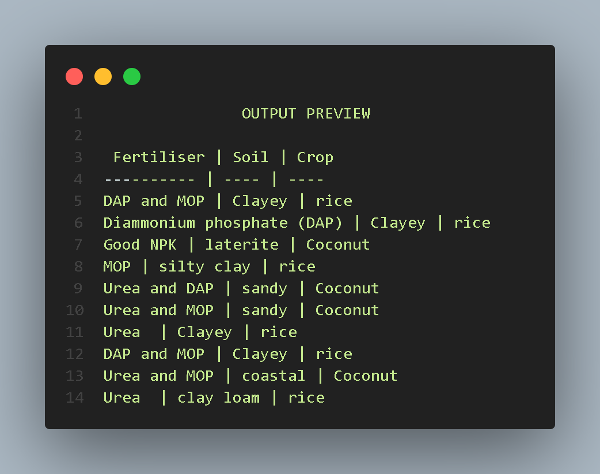

# SOIL CROP FERTILIZER PREDICTION
#### open the ipynb file in the folder .ipynb_checkpoints using jupiter notebook
#### run the code step by step
#### you can add your own feachers/data to the [test_fert_soil.csv] file
#### and then run the code from the data/csv loading section.

